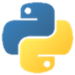

# python_class_SKU2024-04
<picture>
  <source media="(prefers-color-scheme: dark)" srcset="img/python-logo-transparent2.png">
  <source media="(prefers-color-scheme: dark)" srcset="img/python-logo-transparent2.png">
  
</picture>

서경대학교 파이썬 강의 4분반 2024년 1학기 수업 (강좌코드: EE1201-04, EN1004-04) 홈페이지입니다.

### 평가방법
| 중간고사 | 기말고사 |  과제  |  출석  | 프로젝트 |
|:--------:|:--------:|:------:|:------:|:-------:|
|  30%     |  30%     | 20%    |  10%   |  10%    | 

중간고사는 객관식 10문항, 주관식 5문항, 실습 문제 5문항으로 출제됩니다. 
객관식 문제와 주관식 문제는 각 1점, 실습 문제는 각 3점입니다. 
기말고사는 실습 문제 5문항, 각 6점으로 출제됩니다. 
과제는 교과서 연습 문제 5 ~ 10 문제 입니다. 
출석은 출결앱의 인증번호 방식으로 진행합니다. 
프로젝트는 시범적으로 시행하기 때문에 Pass/Fail로 점수가 나갑니다. 

### 시험 문제 예시
```python
x = 'a'
x, y = 0, 1
x ** y > ~x
```
1. 보기에서 상기 파이썬 코드의 실행 결과에 해당하는 항목을 고르시오

보기: &ensp;&ensp; 1) True &ensp;&ensp;&ensp; 2) False &ensp;&ensp;&ensp; 3) -1 &ensp;&ensp;&ensp;&ensp; 4) 0 &ensp;&ensp;&ensp;&ensp; 5) 1  

```python

```


